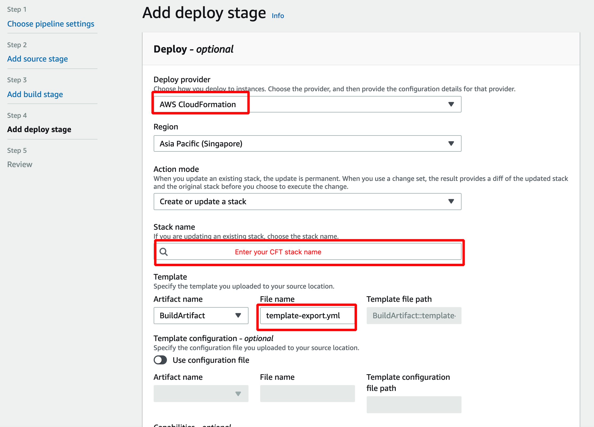
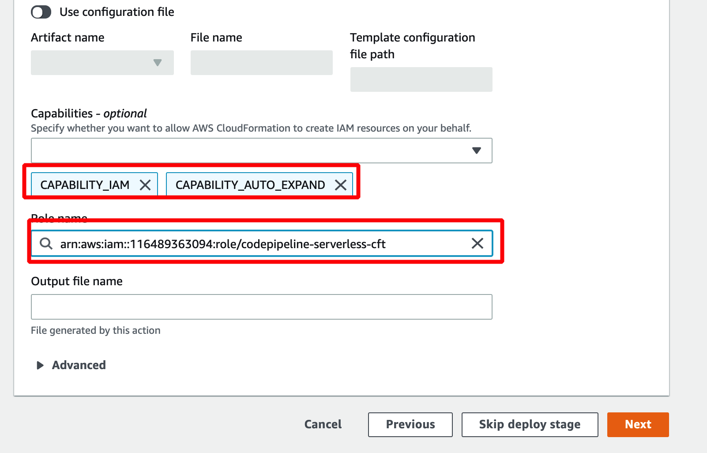
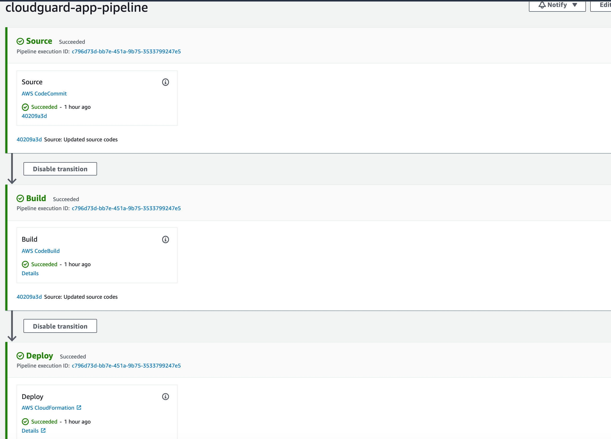
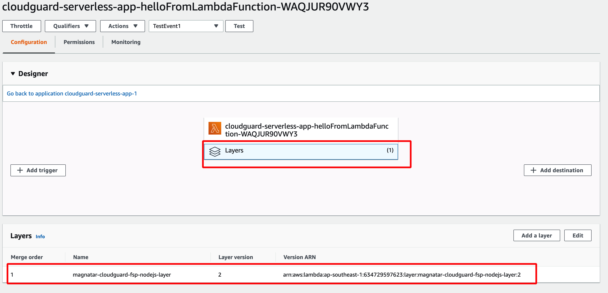
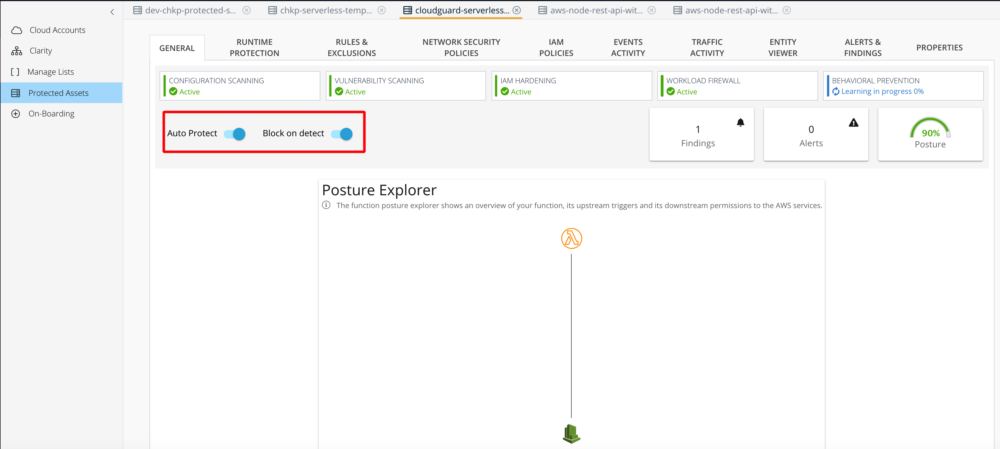
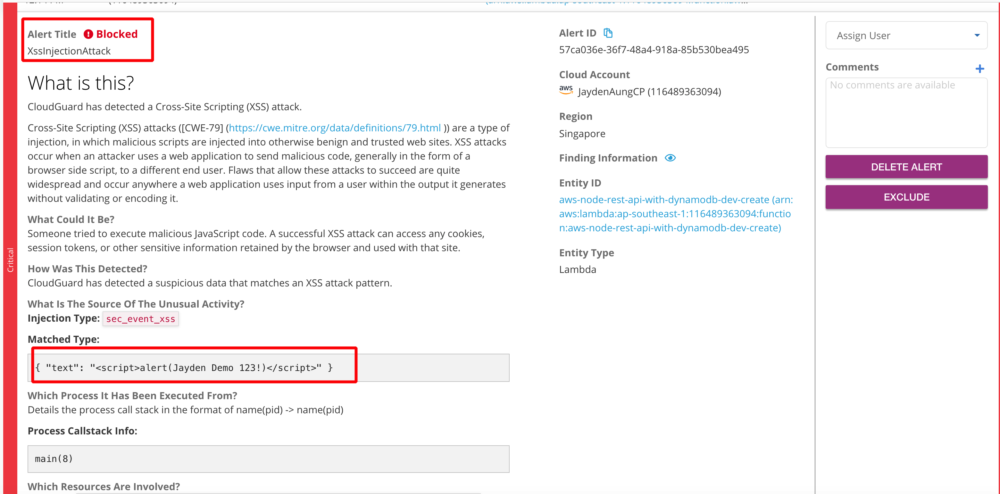

# CloudGuard integration with CICD pipeline on AWS Codepipeline

While serverless functions are becoming more and more popular with cloud-native application developments, we've also started seeing  security challenges that come with the hype. Serverless applications are also at risk of [OWASP top ten application vulnerabilities](https://owasp.org/www-project-serverless-top-10/) because they will still execute code. If the code is written in a manner that doesn't follow security best practices, or if the function is using excessive permissions, they can be vulnerable to a wide range of security attacks.

In this tutorial, I'll do a walk-thorugh of how we can use CloudGuard workload protection to secure your serverless applications. CloudGuard workload protection can assess your Lambda code for vulnerabilties and embedded credentials, excessive permissions, and enable active protection/workload firewall for your serverless workloads. 

This project contains source code (zip) and supporting files for a serverless application that you can deploy with the command line interface (CLI) and scripts. We're gonna deploy a sample serverless application. Let's get started

#Pre-requisites
You need the following tools on your computer:

* AWS CLI [Install AWS CLI](https://docs.aws.amazon.com/cli/latest/userguide/cli-chap-install.html).
* AWS SAM CLI - [Install the AWS SAM CLI](https://docs.aws.amazon.com/serverless-application-model/latest/developerguide/serverless-sam-cli-install.html).
* Node.js - [Install Node.js 12](https://nodejs.org/en/), including the npm package management tool.
* Docker - [Install Docker community edition](https://hub.docker.com/search/?type=edition&offering=community).

###CloudGuard CSPM Account

* CloudGuard Account (https://secure.dome9.com/v2)
* CloudGuard API and API Secret 

AWS roles needed to be created for the following services:

* CodeCommit
* CodeBuild
* CodeDeploy
* CodePipeline
* Lambda Function 

The roles will be created as part of creating a codepipeline. Please take note that the role used by codebulid requires permission to access to a number of AWS resources such as S3. 

## What exactly we will be doing

We'll need to do the followings;

1. Create AWS CodeCommit repo
(Yes if you'd like to follow along my ALL-AWS tutorial, you'll need to create a CodeCommit repo which will be used in CICD pipeline. In this Github repo, I've uploaded Nodejs application source code zip file, buildspec.yml, and other scripts)
2. Create a Codepipeline
3. Integrate CloudGuard to protect the serverless app at build stage
4. Observe that any change in the codecommit repo will trigger the pipeline, and in the build stage, CloudGuard will be enabled and integrated to the serverless application
5. Verify that Proact and FSP for the serverless application are enabled on the CloudGuard console.

## Create a CodeCommit Repository
First you'll need to create a Codecommit on AWS. You can do it on AWS web console or you can just execute the following command.

```bash
aws codecommit create-repository --repository-name cloudguard-serverless-cicd-codepipeline --repository-description "CloudGuard Serverless CICD Pipeline Demo Pipeline"
```

Then you'll need to do 'git clone your codepipline reop' via either SSH or HTTP.  It'll be an empty repository first. Then you will need to download the soure files (zip) into your local repo [here](https://github.com/jaydenaung/cloudguard-serverless-cicd-codepipeline/blob/master/dev-serverless.zip) 

- Unzip the source files (It will create a folder. You'll need to move the files from that folder to root directory.)
- Remove the zip file (and the empty folder)


- Download the following files from this GitHub repo to your CodeCommit local directory.

1. buildspec.yml
2. sam_deploy.sh
3. cloudguard-config.json 
4. my-pipeline.json (Optional)
5. You may add .gitignore & README.md if you'd like

- Then you'll need to do `git init`, `git add -A`, `git commit -m "Your message"` and `git push`

You should see the following files and folders in your **CodeCommit Repo**. 

```bash
$ ls
README.md              node_modules           template.yml
__tests__              cloudguard-config.json    
buildspec.yml          my-pipeline.json       package.json           src
$
``` 

You'll need to create an S3 bucket.

```bash
aws s3 mb s3://Your-Bucket-Name
```


### Deploy the serverless application user [sam_deploy.sh](https://github.com/jaydenaung/cloudguard-serverless-cicd-codepipeline/blob/master/sam_deploy.sh)

Download the sam_deploy.sh script from this git repo to your local directory, and run it. 

```bash
./sam_deploy.sh
```

Expected output:

```
./sam_deploy.sh
Enter S3 Bucket Name: chkp-jayden-serverless-apps-source
Enter Your CFT Stack Name: chkp-jayden-dev-serverless-app
[Task 1] Packaging your serverless application based on template.yml
Uploading to c3e4be0a0b3cbe688e90f2b571a38f47  373 / 373.0  (100.00%)

Successfully packaged artifacts and wrote output template to file out.yml.
Execute the following command to deploy the packaged template
sam deploy --template-file /Users/jaydenaung/git/serverless/dev-serverless-repo/out.yml --stack-name <YOUR STACK NAME>

[Task 2] Deploying your application now..

	Deploying with following values
	===============================
	Stack name                 : chkp-jayden-dev-serverless-app
	Region                     : None
	Confirm changeset          : False
	Deployment s3 bucket       : None
	Capabilities               : ["CAPABILITY_IAM"]
	Parameter overrides        : {}

Initiating deployment
=====================

Waiting for changeset to be created..

CloudFormation stack changeset
---------------------------------------------------------------------------------------------------------------------------------------------------------------------------
Operation                                                 LogicalResourceId                                         ResourceType                                            
---------------------------------------------------------------------------------------------------------------------------------------------------------------------------
+ Add                                                     helloFromLambdaFunctionRole                               AWS::IAM::Role                                          
+ Add                                                     helloFromLambdaFunction                                   AWS::Lambda::Function                                   
---------------------------------------------------------------------------------------------------------------------------------------------------------------------------

Changeset created successfully. arn:aws:cloudformation:ap-southeast-1:116489363094:changeSet/samcli-deploy1601635751/a1274a36-42d3-4225-b021-cb3c1fc5d839


2020-10-02 18:49:22 - Waiting for stack create/update to complete

CloudFormation events from changeset
-------------------------------------------------------------------------------------------------------------------------------------------------------------------------
ResourceStatus                             ResourceType                               LogicalResourceId                          ResourceStatusReason                     
-------------------------------------------------------------------------------------------------------------------------------------------------------------------------
CREATE_IN_PROGRESS                         AWS::IAM::Role                             helloFromLambdaFunctionRole                -                                        
CREATE_IN_PROGRESS                         AWS::IAM::Role                             helloFromLambdaFunctionRole                Resource creation Initiated              
CREATE_COMPLETE                            AWS::IAM::Role                             helloFromLambdaFunctionRole                -                                        
CREATE_IN_PROGRESS                         AWS::Lambda::Function                      helloFromLambdaFunction                    -                                        
CREATE_IN_PROGRESS                         AWS::Lambda::Function                      helloFromLambdaFunction                    Resource creation Initiated              
CREATE_COMPLETE                            AWS::Lambda::Function                      helloFromLambdaFunction                    -                                        
CREATE_COMPLETE                            AWS::CloudFormation::Stack                 chkp-jayden-dev-serverless-app             -                                        
-------------------------------------------------------------------------------------------------------------------------------------------------------------------------

Successfully created/updated stack - chkp-jayden-dev-serverless-app in None

Your serverless application has been deployed.
```

Now that your cloudformation stack has been deployed, you also have a Lambda function now. You can test the Lambda fucntion on AWS web console. 

We'll need the ARN of the cloudformation stack as well. Go to AWS Web Console => Cloudformation => Stacks, and take note the ARN of the stack that has just been created. (It looks like this:  arn:aws:cloudformation:ap-southeast-1:116489363094:stack/chkp-serverless-app/a6d77c70-048a-11eb-8438-02e7c9cae2dc)

## buildspec.yml

In the buildsepc.yml, replace the following values with your own (without []):

1. AWS_REGION=[Your REGION]
2. S3_BUCKET=[YOUR BUCKET NAME]
3. cloudguard fsp -c [The ARN of Your Cloudformation stack you just took note of]

```
version: 0.2

phases:
  install:
    commands:
      # Install all dependencies (including dependencies for running tests)
      - npm install
      - pip install --upgrade awscli
  pre_build:
    commands:
      # Discover and run unit tests in the '__tests__' directory
      #- npm run test
      # Remove all unit tests to reduce the size of the package that will be ultimately uploaded to Lambda
      #- rm -rf ./__tests__
      # Remove all dependencies not needed for the Lambda deployment package (the packages from devDependencies in package.json)
      #- npm prune --production
  build:
    commands:
      # Install the CloudGuard Workload CLI Plugin
      - npm install -g https://artifactory.app.protego.io/cloudguard-serverless-plugin.tgz
      # Set your AWS region variable
      - export AWS_REGION=[Your REGION]
      # Configure the CloudGuard Workload Proact security on the SAM template
      - cloudguard proact -m template.yml
      # Set the S3 bucket name variable
      - export S3_BUCKET=[YOUR BUCKET NAME]
      # Use AWS SAM to package the application by using AWS CloudFormation
      - aws cloudformation package --template template.yml --s3-bucket $S3_BUCKET --output-template template-export.yml
   # commands:
      # Add the FSP Runtime security to the deployed function. Please replace with the function cloudformation arn!
      - cloudguard fsp -c [The ARN of Your Cloudformation stack you just took note of]
artifacts:
  type: zip
  files:
    - template-export.yml
```

## Create a Codepipeline

Now if you're like me who likes to do things using CLI, you can edit "my-pipeline.json" which you can find in this repo, and execute the following CLI.

```bash
aws codepipeline create-pipeline --cli-input-json file://my-pipeline.json
```

Otherwise, please follow the step-by-step guide to create a Codepipeline.

### Codepipeline - Initial setting

Now that we have a  let's create a codepipeline.

1. Go to "Codepipeline" on AWS console
2. Create Pipeline
3. Enter your pipeline's name
4. If you already have an existing role, choose it. Or create a new role.

 

### Codepipeline - Source
Then we can add source.

1. Choose "CodeCommit" (You can use Github or any code repo. If you're following along my tutorial, choose CodeCommit.)
2. Choose Repository name - the CodeCommit repo that you've created earlier.
3. Choose Master Branch
4. For change detection, Choose "CloudWatch Events".

 

### Codepipeline - Build Stage
We need to configure the build environment.

1. Choose "CodeBuild" & choose your region.
2. If you don't already have a codebuild project, choose "Create Project".


 

In CodeBuild windows, do the following;

1. Enter your project name
2. Choose "Managed Image" and "Ubuntu" as Operating system

 

3. Choose "Standard" & "Standard:3.0" (It's totally up to you to choose actually. But this setting works for Nodejs 12.x apps)
4. Check "Privileged ...." checkbox
5. Choose an existing role or create a new service role.


> Now, please take note that codebuild role requires permissions to access a number of AWS services including Lambda, Cloudformation template and IAM. You will encounter issues while Codebuild is building the app.


 

### Codepipeline - Deploy Stage 

In Deploy stage, we'll have to do the following;

1. Choose "Cloudformation" as Deploy Provider 
2. Choose your region
3. Action mode: "Create or update a stack" (You can also use ChangeSet)
4. Stack Name: **Choose the CFT Stack that you've created for your Lambda function**
5. As for Artifacts, Enter "template-export.yml" as defined in buildspec.yml.

 

 

Your pipeline has been created. Any change in your source code in AWS Codecommit will trigger the pipeline. In build stage, CloudGuard will protect the serverless application by enabling Proact, and FSP which will be added to the Lambda function as a layer.

You can check and verify that each stage of your CodePipline has been successfully completed!

 

## Verification of CloudGuard protection

On AWS Console, go to "Lambda", and the function that we've enabled the protection on. Verify that a layer has been added to the function.

 


You can log on to your CloudGuard console, and go to the Serverless module or Protected Assets. Check your Lambda function.

 

## Code Injection Attack Simulation

In a scenario where you expose Lambda function via HTTP endpoints provided by API Gateway, your serverless application is vulnerable to numerous code injection attacks. If you've turned on Function Self-Protection (FSP) on CloudGuard for that particular Lambda function, your application can be secured and protected by CloudGuard workload protection. CloudGuard will block active code injection attacks when the application is in runtime.

In below example, I've simulated a simple code injection attack using curl. And you can see that the attack wasn't successful. (Internal Server Error)

 

> On CloudGuard, you can see that the code injection attack was **blocked** by CloudGuard. 

 

## Cleanup

To delete the sample application that you created, use the AWS CLI. Assuming you used your project name for the stack name, you can run the following:

### Delete the pipeline

```bash
aws codepipeline delete-pipeline --name MyPipeline
```

```bash
aws cloudformation delete-stack --stack-name cloudguard-serverless-app
```

## Resources


